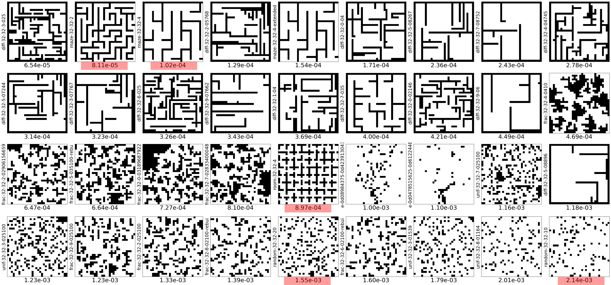

# MAPF-Lambda2
This is the code repo for ICAPS-24 paper: "Map Connectivity and Empirical Hardness of Grid-based Multi-Agent Pathfinding Problem"

# Dataset

The following figure shows the detailed map information for Experiment 1 in the paper. $\lambda_2$ is annotate on x-axis and the smallest $\lambda_2$ map is at the top left corner. Maps from the MovingAI benchmark dataset are marked in red. All other maps are generated using our fractal and QD instance generator. The map files can be found in `dataset/ICAPS-24`.

# Usage

TODO